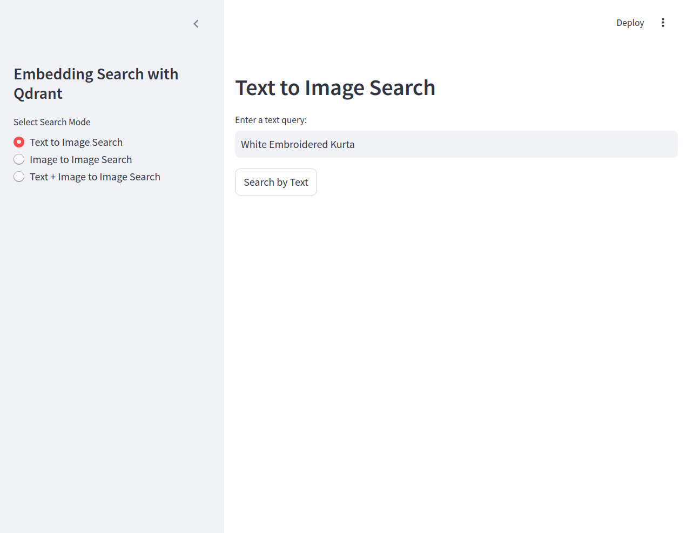
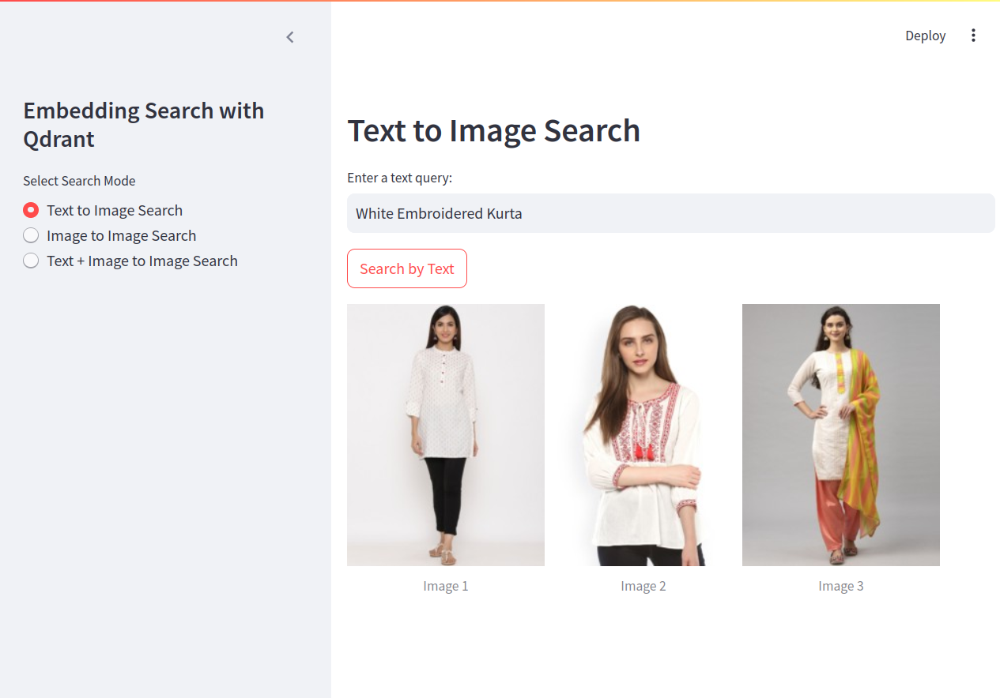
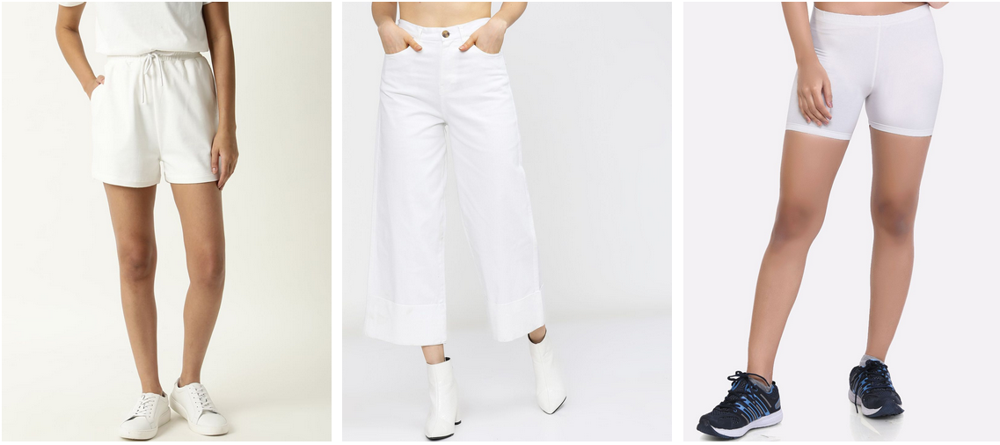
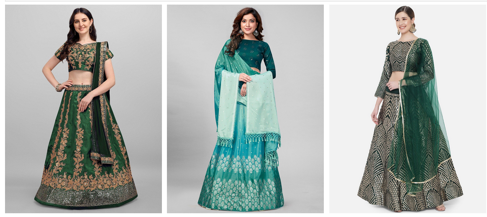

# MultiModel Semantic Image Search using Qdrant Vector Database & Google MultiModel LLM

This repository contains a semantic image search system built using the Qdrant vector database and Google MultiModel LLM. The system supports the following search functionalities:
- **Text-to-Image Search:** Retrieve images based on a textual query.
- **Image-to-Image Search:** Retrieve similar images based on an input image.
- **Text + Image-to-Image Search:** Retrieve images based on a combination of text and image input.

## Table of Contents
1. [Introduction](#introduction)
2. [Features](#features)
3. [Installation](#installation)
4. [Usage](#usage)
   - [Text-to-Image Search](#text-to-image-search)
   - [Image-to-Image Search](#image-to-image-search)
   - [Text + Image-to-Image Search](#text--image-to-image-search)

## Introduction

This project demonstrates how to use the Quadrant vector database and Google Multmodel LLM to perform semantic searches for images. By leveraging vector embeddings, the system enables efficient and accurate search capabilities, making it possible to retrieve images that match a given textual description, are visually similar to a provided image, or match a combination of both.

## Features

- **Scalable and Efficient:** Uses Qdrant's high-performance vector database for fast and scalable searches.
- **Flexible Input Types:** Supports various search modalities, including text, images, and a combination of both.
- **Customizable:** The system is designed to be easily extended with different models and configurations.

## Installation

To set up the project locally, follow these steps:

1. **Clone the repository:**
   ```bash
   git clone https://github.com/kshitizregmi/SemanticImageSearchEngine.git ```
2. **Install dependencies:**
  ```bash
    pip install -r requirements.txt
```

## Usage
```bash
streamlit run inference_app.py
```
The following examples illustrate how to use the system for different types of searches:

### Text-to-Image Search



Output:




### Image-to-Image Search


Output:




### Text + Image-to-Image Search

Input Text: ```Green Lehenga Choli```

Input Image:


Output:


